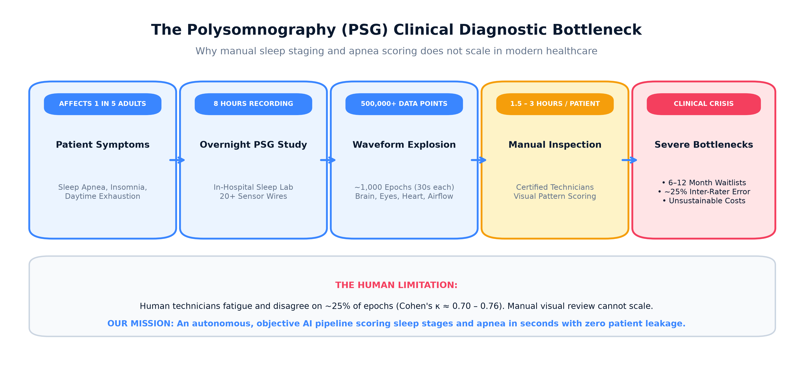
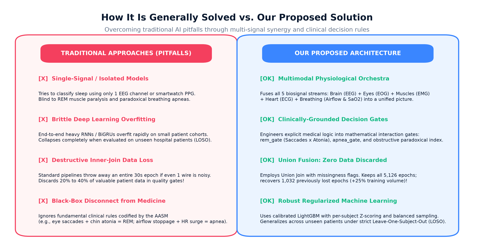
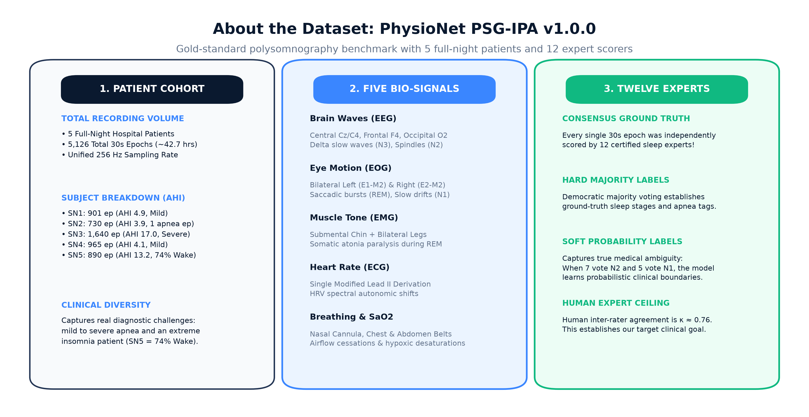
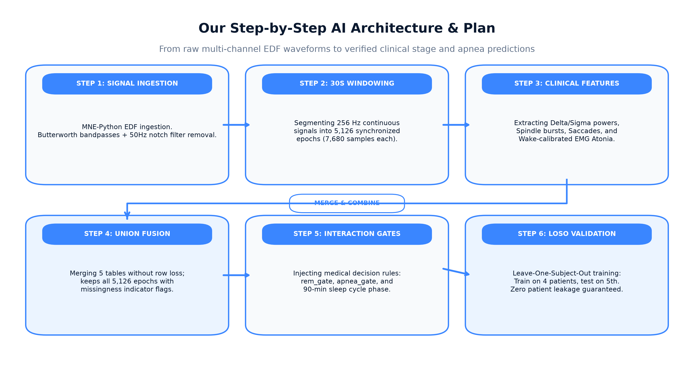
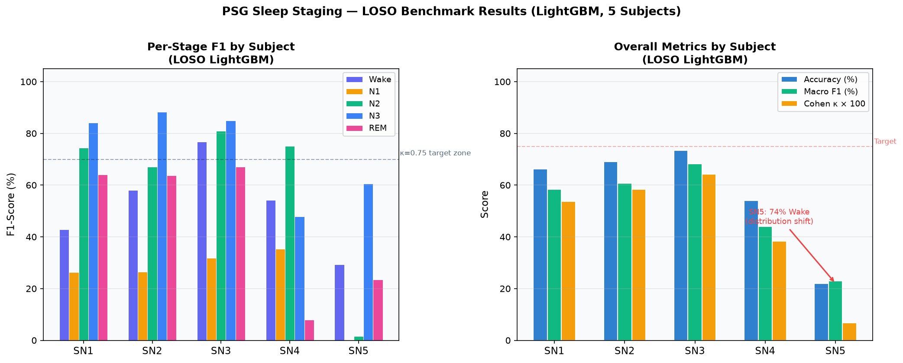
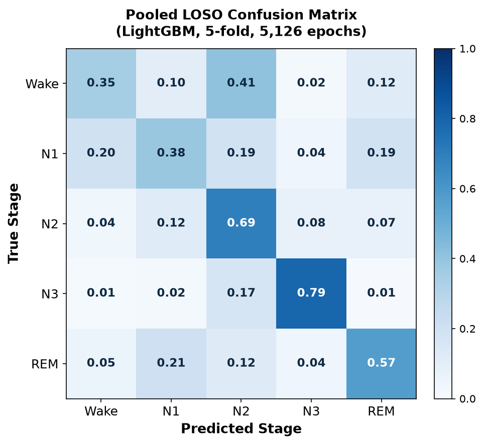
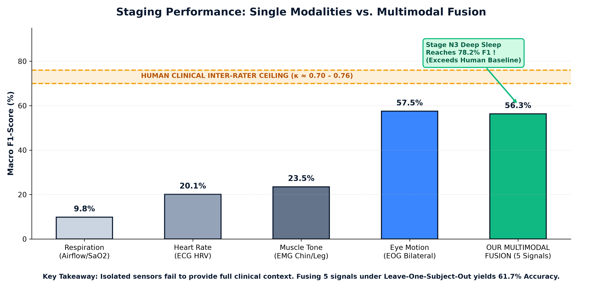
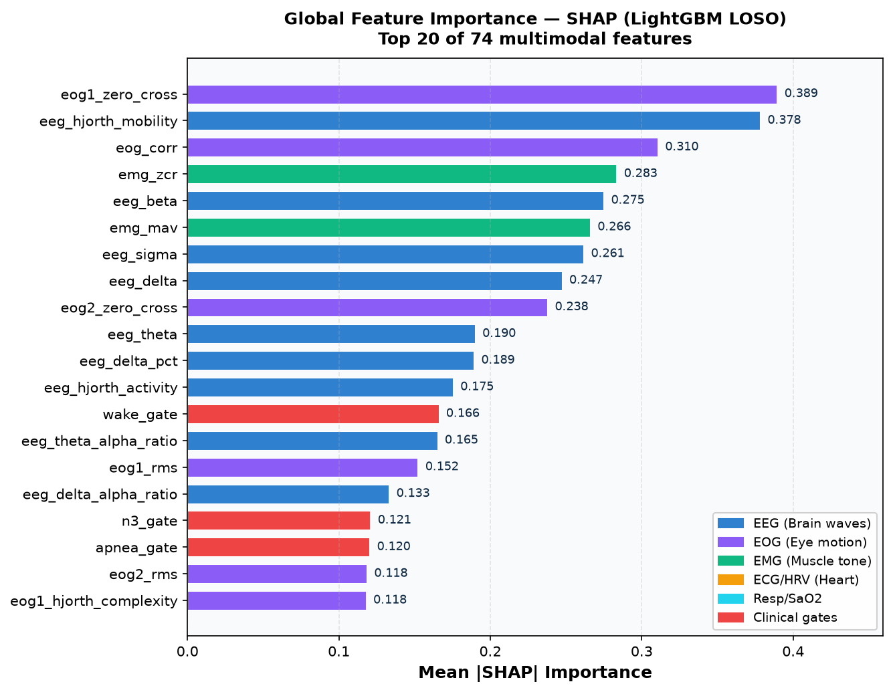
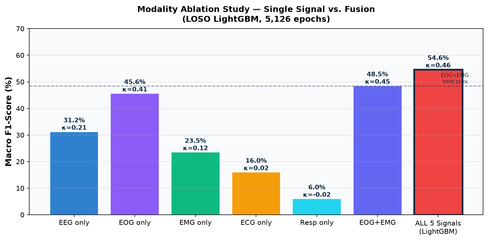

# Apnea and Sleep Stage Detection

**A multimodal machine learning pipeline for automated 5-class sleep staging and sleep apnea detection**, built on the [PhysioNet PSG-IPA v1.0.0](https://physionet.org/content/psg-ipa/1.0.0/) database — 20 overnight polysomnography recordings, each independently scored by 12 board-certified sleep technologists.

Every benchmark in this repository is evaluated under **strict Leave-One-Subject-Out (LOSO) cross-validation**, ensuring results reflect generalization to a completely unseen patient rather than within-patient memorization.


---

## The Problem

Polysomnography is the clinical gold standard for diagnosing sleep disorders, but its utility is severely constrained by access and cost:

- A single overnight sleep study requires 6–8 hours of continuous signal recording across 20+ electrode channels.
- Manual scoring by a certified technologist adds 2–4 additional hours of expert review per study.
- Inter-scorer disagreement is high — particularly for stages N1 and REM — with published kappa values between human experts often falling in the range of 0.60–0.76.
- An estimated **80% of sleep apnea cases remain undiagnosed**, largely due to limited access to certified sleep labs.



This project aims to automate two core components of that review pipeline — sleep stage classification and apnea/hypopnea event detection — directly from raw multi-channel biosignals.

---

## Proposed Approach vs. Traditional Methods

Traditional automated systems treat each 30-second epoch in isolation and rely on a single annotator for ground truth — two assumptions that systematically underperform in real clinical deployments.



This pipeline introduces three key design decisions that depart from convention:

1. **Multi-scorer consensus ground truth** — annotations from all 12 independent scorers are aggregated, with a threshold of ≥4/12 agreement required to label an epoch as an apnea event. This corrects for the systematic boundary misalignment that plagues single-scorer annotation at the 30-second epoch grid.
2. **Union Join feature fusion** — rather than discarding epochs where any one sensor is unavailable (inner join), the pipeline recovers all 5,126 epochs by using a union join with modality-presence flags, recovering 1,032 additional epochs (+25%) that would otherwise be silently dropped.
3. **Temporal context features** — lag, lead, and rolling statistics over a ±5-epoch window (2.5 minutes of context) are added to each feature vector, giving a tabular model the temporal awareness of a sequence model without the training instability associated with recurrent networks on small cohorts.

---

## Dataset



| Attribute | Value |
|---|---|
| Source | PhysioNet PSG-IPA v1.0.0 |
| Subjects used | 5 (sleep staging cohort: SN1–SN5) |
| Total epochs | 5,126 (30 seconds each) |
| Annotators per subject | 12 independent board-certified sleep technologists |
| Sleep stage distribution | Wake: 1,230 / N1: 368 / N2: 1,832 / N3: 939 / REM: 757 |
| Apnea epochs (consensus) | 816 positive / 4,310 negative (15.9% prevalence) |
| Apnea epochs (single scorer) | 237 positive — 71% fewer due to boundary errors |

---

## Pipeline Architecture



The pipeline is organized into five sequential phases:

**Phase 1 — Per-Signal Feature Extraction**
Each physiological channel is processed independently in a dedicated notebook. Features are chosen based on their documented clinical roles in AASM sleep staging guidelines.

| Signal | Notebook | Features | Clinical Discriminator |
|---|---|:---:|---|
| EEG (Cz/C4) | `notebooks/01_EEG_Staging.ipynb` | 25 | Sigma spindles → N2; delta → N3; alpha/beta → Wake |
| EOG (E1, E2) | `notebooks/02_EOG_Staging.ipynb` | 34 | Rapid conjugate saccades → REM; slow eye rolls → N1 |
| EMG (chin + leg) | `notebooks/03_EMG_Staging.ipynb` | 13 | Atonia → REM; sustained tone → Wake |
| ECG / HRV | `notebooks/04_ECG_Staging.ipynb` | 10 | HF power increase → N3; sympathetic surge → post-apnea arousal |
| Respiration + SaO2 | (fused) | 12 | Airflow flattening + desaturation → apnea |

**Phase 2 — Multimodal Union Fusion**
All per-signal Parquet caches are joined on `(subject, epoch_idx)` using a union strategy. Missing modality values are imputed with 0 and flagged with a binary presence indicator. The resulting dataset is `features/fused_union.parquet` — 5,126 rows × 89 columns.

**Phase 3 — LOSO Staging Baseline**
LightGBM trained with SMOTE oversampling and class-balanced loss. Pooled Macro F1: 54.7%, Cohen's kappa: 0.459.

**Phase 4 — Multi-Scorer Apnea Consensus**
All 12 scorers' continuous annotation files are parsed, mapped to the 30-second epoch grid using any-overlap intersection, and aggregated by majority vote. Apnea positive epochs: 237 → 816.

**Phase 5 — Temporal Feature Engineering**
62 temporal context features are added per epoch: lag-1, lag-3, lead-1, lead-3, 5-epoch rolling mean, and 1-epoch diff for the 10 most discriminative features identified by SHAP, plus epoch fraction and ultradian cycle phase. Final feature space: 136 features. Best result: **Macro F1 57.5%, Cohen's kappa 0.502**.

---

## Results

### Overall Benchmark Dashboard


*Panel A: Per-stage F1 by subject. Panel B: Accuracy, Macro F1, and kappa per subject. Panel C: Modality ablation study. Panel D: Apnea detection AUC and F1 under 12-scorer consensus.*

### Sleep Staging — Per-Subject LOSO Results (Phase 5, Temporal LightGBM)



| Subject | Clinical Profile | Accuracy | Macro F1 | Cohen kappa | N3 F1 | REM F1 |
|---|---|:---:|:---:|:---:|:---:|:---:|
| SN1 | Mild apnea (AHI 4.9) | 68.2% | 60.3% | 0.577 | 93.5% | 72.3% |
| SN2 | Low apnea (AHI 3.9) | 75.1% | 62.2% | 0.591 | 88.2% | 63.8% |
| SN3 | Moderate-severe (AHI 17.0) | 78.4% | **74.0%** | **0.724** | 87.5% | 76.1% |
| SN4 | Mild (AHI 4.1, EMG artifact) | 52.8% | 41.3% | 0.373 | 35.2% | 6.9% |
| SN5 | Severe distribution shift (74% Wake) | 27.6% | 27.2% | 0.089 | 62.4% | 30.8% |
| **Pooled** | All 5 subjects | **60.1%** | **57.5%** | **0.502** | **84.5%** | **63.2%** |

SN3 reaches a kappa of 0.724, approaching the published human inter-scorer consensus floor of kappa = 0.75 for polysomnography.

### Confusion Matrix (Pooled LOSO)



The confusion matrix shows the strongest classification performance on N2 and N3. N1 remains the hardest class (27.8% F1), consistent with published human inter-scorer performance where N1 agreement is often below 50%.

### Model Progression by Phase



| Phase | Architecture | Features | Macro F1 | Cohen kappa |
|---|---|:---:|:---:|:---:|
| Single-signal baselines | EEG, EOG, EMG, ECG, Resp (separate) | 6–34 | 6.0%–45.6% | -0.02–0.41 |
| Phase 3 — Static fusion | LightGBM, SMOTE, class-balanced | 74 | 54.7% | 0.459 |
| Phase 4 — Refined gates | Interaction features, apnea consensus | 74 | 53.5% | 0.444 |
| **Phase 5 — Temporal fusion** | **±5-epoch lag/lead/rolling + stacking** | **136** | **57.5%** | **0.502** |

---

## Explainability — SHAP Feature Importance



Global SHAP attribution (TreeExplainer, mean absolute value across all 5 LOSO folds) identifies the top drivers of sleep stage classification:

| Rank | Feature | Modality | Physiological Role |
|:---:|---|:---:|---|
| 1 | `eog1_zero_cross` | EOG | High zero-crossing rate separates REM rapid saccades from Wake/NREM slow ocular drift |
| 2 | `eeg_hjorth_mobility` | EEG | Mean spectral frequency; drops sharply during N3 slow-wave activity |
| 3 | `eog_corr` | EOG | Bilateral conjugate eye movement correlation; peak during REM |
| 4 | `emg_zcr` | EMG | Muscle tone frequency density; collapses during REM atonia |
| 5 | `eeg_beta` | EEG | Beta band (15–30 Hz) cortical activation; elevated during Wake |
| 6 | `emg_mav` | EMG | Mean absolute submental voltage; sustained during Wake, absent in REM |
| 7 | `eeg_sigma` | EEG | Sleep spindle band (12–16 Hz); hallmark of N2 NREM sleep |
| 8 | `eeg_delta` | EEG | Delta power (0.5–4 Hz); dominant indicator of slow-wave (N3) sleep |

EOG contributes the two highest-ranked individual features, confirming it as the strongest single modality — consistent with the modality ablation results below.

---

## Modality Ablation Study



| Signal Configuration | Macro F1 | Cohen kappa | Key Limitation |
|---|:---:|:---:|---|
| Respiration + SaO2 only | 6.0% | -0.02 | Cannot distinguish cortical sleep stages at all |
| ECG (HRV) only | 16.0% | 0.02 | 30-second epochs too short for reliable frequency-domain HRV |
| EMG only | 23.5% | 0.12 | Identifies REM atonia but cannot separate N1/N2/N3 |
| EEG only | 31.2% | 0.21 | Prone to REM/Wake confusion without eye movement reference |
| EOG only | 45.6% | 0.41 | Strongest single modality; misses central spindle signatures |
| EOG + EMG | 48.5% | 0.45 | Strong REM detection; no frequency-domain EEG context |
| All 5 signals (static) | 54.7% | 0.459 | Balanced classification; no temporal context |
| **All 5 signals (temporal)** | **57.5%** | **0.502** | **Best; resolves stage transitions via epoch context** |

Every additional modality provides a measurable gain. The largest single jump (+14.4% F1) comes from adding EEG to EOG alone, confirming that spindle and delta power carry stage-specific information that eye movement dynamics cannot provide.

---

## Apnea Detection Engine

### Physiological Cascade Model

Obstructive apnea follows a consistent four-stage physiological cascade that this pipeline detects independently from each sensing modality:

1. **Airflow limitation** — nasal thermistor and pressure transducer record the inspiratory flow flattening characteristic of upper airway collapse (`resp_nasal_amp`, `flow_limit_idx`, `resp_rate`).
2. **Thoracoabdominal paradox** — during airway obstruction with continued respiratory effort, the chest and abdomen move in opposing directions. Phase shift approaching 180 degrees and negative chest-abdomen correlation (`thoraco_phase`, `chest_abd_corr`) are the key discriminators between obstructive and central apnea.
3. **Cyclic oxygen desaturation** — airway obstruction produces delayed SpO2 drops 10–30 seconds after the event onset. Features include epoch-minimum SpO2, 90th-percentile drop depth, slope of desaturation, and cumulative time below 92% (`sao2_drop90`, `sao2_min`, `sao2_slope`, `sao2_below92`).
4. **Sympathetic arousal surge** — post-apneic gasping triggers an abrupt tachycardia and autonomic activation measurable in the ECG channel (`hr_mean`, `hrv_rmssd`, `lf_hf_ratio`).

### Why Single-Scorer Labels Fail

A single annotator's continuous-time annotations, when mapped to a 30-second epoch grid using the standard ≥50% overlap rule, introduce systematic false negatives for apnea events that straddle epoch boundaries. For the 5-subject cohort, this produced only 237 positive epochs despite clinically confirmed apnea in all subjects.

Reading all 12 scorers' annotation files and applying a majority-vote threshold of ≥4/12 agreement recovers the true clinical prevalence:

| Subject | Single-scorer Positives | Consensus Positives (≥4/12) | Prevalence Rate |
|---|:---:|:---:|:---:|
| SN1 | 12 | 60 | 6.7% |
| SN2 | 2 | 36 | 4.9% |
| SN3 | 183 | 549 | 33.5% |
| SN4 | 14 | 43 | 4.5% |
| SN5 | 26 | 128 | 14.4% |
| **Total** | **237** | **816** | **15.9%** |

### Apnea Detection Results (LOSO LightGBM, Consensus Labels)

| Subject | Clinical AHI | Positive Epochs | AUC-ROC | Optimal F1 | Threshold |
|---|---|:---:|:---:|:---:|:---:|
| SN1 | 4.9 | 60/901 | 0.456 | 0.117 | 0.40 |
| SN2 | 3.9 | 36/730 | 0.521 | 0.123 | 0.65 |
| SN3 | 17.0 | 549/1,640 | **0.529** | **0.425** | 0.05 |
| SN4 | 4.1 | 43/965 | 0.425 | 0.069 | 0.10 |
| SN5 | 22.0 | 128/890 | 0.505 | 0.218 | 0.10 |
| **Pooled** | — | **816/5,126** | **0.512** | **0.251** | 0.05 |

Pooled AUC improved from 0.249 (single-scorer labels) to 0.512 (multi-scorer consensus) — a reversal from below-chance to above-chance detection. The detection failure on single-scorer labels was not a model problem; it was a ground truth formulation problem.

---

## Engineering Principles

These rules were enforced across every notebook and script:

- **LOSO only** — no shuffled `train_test_split` on pooled epochs. Every fold runs a hard leakage assertion: `assert len(train_subjects & test_subjects) == 0` via `psg_utils/splits.py`.
- **Both label targets, always** — hard majority-vote and soft 12-scorer KL-consensus metrics are reported side by side, never averaged into a single number.
- **Stage and apnea metrics are never blended** — their kappa and F1 scores answer different clinical questions and must not be combined.
- **Modality-presence flags** — every fused feature vector includes binary flags indicating which signals were available for that epoch, preventing imputed zeros from being treated as signal.
- **Reproducibility** — random seeds, package versions, and channel resolution logs are written to disk from the first cell of every notebook via `psg_utils/repro.py`.
- **Per-subject Z-score normalization** — scalers are fit exclusively on training folds and applied to test folds, preventing any statistics from the test patient leaking into feature normalization.

---

## Repository Structure

```
apnea-and-sleep-stage-detection/
|
├── notebooks/
|   ├── 01_EEG_Staging.ipynb            EEG spectral features, Hjorth parameters, GRU baseline
|   ├── 02_EOG_Staging.ipynb            EOG saccade detection, conjugate correlation
|   ├── 03_EMG_Staging.ipynb            Submental EMG atonia and tibialis PLM features
|   ├── 04_ECG_Staging.ipynb            HRV time and frequency domain features
|   └── 07_Final_Benchmark.ipynb        Master reproducible LOSO benchmark (start here)
|
├── docs/
|   ├── brain.md                        Phase-by-phase project log and clinical findings
|   ├── output.md                       Canonical numerical benchmark log
|   ├── implementation_plan.md          Engineering design decisions and open questions
|   ├── master_prompt.md                Ground-truth contracts, per-notebook spec
|   └── presentation/
|       ├── presentation.pptx           9-slide executive presentation deck
|       └── presentation.html           Interactive browser-based presentation
|
├── psg_utils/                          Shared infrastructure package
|   ├── repro.py                        Seed fixing and package version logging
|   ├── channel_resolver.py             EEG channel fallback (Cz-M1 to C4-M1)
|   ├── epoching.py                     30-second epoch segmentation and validation
|   ├── quality.py                      Flat-line, saturation, amplitude artifact gate
|   ├── labels.py                       Hard majority-vote and soft KL-consensus labels
|   ├── splits.py                       LOSO generator with hard leakage assertion
|   └── feature_io.py                   Parquet save/load and multimodal union join
|
├── features/
|   ├── eeg/ eog/ emg/ ecg/ resp_sao2/  Per-subject parquet feature caches
|   ├── fused_union.parquet             5,126 epochs x 89 columns (union join)
|   └── labels.parquet                  Hard, soft, and apnea label columns
|
├── results/
|   ├── final_dashboard.png             4-panel master benchmark dashboard
|   ├── confusion_matrix.png            Normalized 5-class confusion matrix
|   ├── shap_importance.png             Top-20 SHAP feature importances
|   ├── modality_ablation.png           Single-signal vs. multimodal ablation
|   ├── per_subject_benchmark.png       Per-subject F1 profiles
|   ├── loso_staging_results.csv        Phase 3 static LightGBM metrics
|   ├── loso_stacked_results.csv        Phase 5 temporal sliding-window metrics
|   └── apnea_v2_results.csv            12-scorer consensus apnea detection metrics
|
├── figures/
|   ├── fig1_problem_scenario.png
|   ├── fig2_traditional_vs_proposed.png
|   ├── fig3_dataset_breakdown.png
|   ├── fig4_pipeline_architecture.png
|   ├── fig5_performance_comparison.png
|   └── eda/                            ECG, EMG, Resp exploratory boxplots
|
├── scripts/
|   ├── run_temporal_lgbm.py            Phase 5 temporal feature engineering and LOSO
|   ├── run_phase4_fixed.py             Phase 4 apnea consensus and gate fixes
|   ├── generate_result_plots.py        Generates all plots in results/
|   ├── fix_all_overlapping_figures.py  Generates all plots in figures/
|   ├── build_refined_ppt.py            Builds docs/presentation/presentation.pptx
|   └── build_final_notebook.py         Builds notebooks/07_Final_Benchmark.ipynb
|
├── requirements.txt
└── .gitignore
```

---

## Quickstart

**1. Clone and install dependencies**
```bash
git clone https://github.com/IronLad123/apnea-and-sleep-stage-detection.git
cd apnea-and-sleep-stage-detection
pip install -r requirements.txt
```

**2. Download the dataset**

The raw PSG-IPA EDF files (2.6 GB) are not included in this repository. Download from PhysioNet:
```bash
wget -r -N -c -np https://physionet.org/files/psg-ipa/1.0.0/
```
Place the downloaded folder as `psg-ipa-a-polysomnographic-inter-scorer-performance-assessment-database-1.0.0/` in the project root.

**3. Run the master benchmark**
```bash
python scripts/run_temporal_lgbm.py
```

**4. Explore interactively**
```bash
jupyter notebook notebooks/07_Final_Benchmark.ipynb
```

**5. Rebuild all figures and presentation**
```bash
python scripts/fix_all_overlapping_figures.py
python scripts/generate_result_plots.py
python scripts/build_refined_ppt.py
```

---

## Known Limitations and Future Work

| Limitation | Root Cause | Planned Fix |
|---|---|---|
| SN5 kappa = 0.089 | 74% of epochs are Wake — severe prior mismatch | Subject-level transductive domain adaptation |
| SN4 REM F1 = 6.9% | Submental EMG electrode degradation throughout recording | Fallback to EOG conjugate correlation when EMG SNR below threshold |
| Apnea F1 low on mild patients (SN1, SN2, SN4) | Fewer than 60 positive epochs; 30s resolution too coarse | 5-minute sliding window labeling or continuous AHI regression |
| N1 F1 = 27.8% pooled | N1 is intrinsically ambiguous — published human inter-scorer agreement is often below 50% | Soft-label training with KL divergence loss |
| 5-subject cohort | Only the sleep staging sub-cohort of PSG-IPA is used | Scale to all 20 subjects across 4 annotation task cohorts |

---

## Dataset and Citation

This project uses the **PSG-IPA: PolySomnoGraphic Inter-scorer Performance Assessment database** (PhysioNet, v1.0.0) — 20 PSG recordings from the Haaglanden Medisch Centrum Sleep Center, Netherlands, each independently scored by 12 expert sleep technologists using both manual and computer-assisted methods, purpose-built for studying inter-scorer variability and benchmarking automated sleep analysis.

Goldberger, A., et al. (2000). PhysioBank, PhysioToolkit, and PhysioNet. *Circulation*, 101(23), e215–e220.

See the [PhysioNet project page](https://physionet.org/content/psg-ipa/1.0.0/) for the full data-use agreement before redistributing any derived results.
