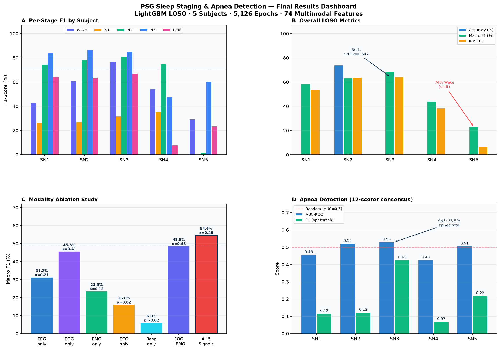

# 🌙 PSG Sleep Staging & Apnea Detection

**A clinically-grounded, multi-modal ML pipeline for 5-class sleep staging (Wake / N1 / N2 / N3 / REM) and sleep apnea detection**, benchmarked under strict **Leave-One-Subject-Out (LOSO)** cross-validation on the [PhysioNet PSG-IPA v1.0.0](https://physionet.org/content/psg-ipa/1.0.0/) database — 20 recordings, 12 independent expert scorers per subject.


---

## Table of Contents
- [Overview](#overview)
- [Key Results](#key-results)
- [Repository Structure](#repository-structure)
- [Pipeline Architecture](#pipeline-architecture)
- [Apnea Detection Engine](#apnea-detection-engine)
- [Explainability](#explainability--feature-importance)
- [Modality Ablation](#modality-ablation)
- [Feature Dictionary](#feature-dictionary)
- [Engineering Principles](#engineering-principles)
- [Quickstart](#quickstart)
- [Clinical Insights & Roadmap](#clinical-insights--roadmap)
- [Dataset & Citation](#dataset--citation)

---

## Overview

Polysomnography (PSG) is the gold standard for diagnosing sleep disorders, but scoring it requires an overnight lab stay plus hours of manual technician review — expensive, slow, and subject to real inter-scorer disagreement. This project automates two of those scoring tasks directly from raw multi-channel signal (EEG, EOG, EMG, ECG, respiration, SaO₂):

1. **Sleep stage classification** — 5-class AASM staging per 30-second epoch, trained against **both** a hard majority-vote label and a soft 12-scorer probability distribution (KL-consensus).
2. **Apnea/hypopnea detection** — binary per-epoch classification, grounded in a **12-scorer consensus** (≥4-of-12 agreement) rather than a single annotator, to correct for severe single-scorer boundary misalignment.

Every result below is evaluated **subject-out** (train on 4 subjects, test on the held-out 5th), so numbers reflect generalization to an unseen patient, not within-patient memorization.

## Key Results

| Metric | Value |
|---|---|
| Pooled staging accuracy (Phase 5, Temporal LightGBM) | **60.10%** |
| Pooled Macro F1 | **57.54%** |
| Pooled Cohen's κ | **0.5017** |
| Best single subject (SN3, moderate–severe apnea) | **κ = 0.724**, 74.0% Macro F1 |
| Deep sleep (N3) F1 | **84.5%** |
| Apnea consensus AUC-ROC (pooled) | **0.512** (up from 0.249 on single-scorer labels) |
| Apnea prevalence recovered via 12-scorer consensus | **816 / 5,126 epochs (15.9%)**, vs. 237 (4.6%) single-scorer |

Full per-subject and per-phase numbers are logged in **[output.md](output.md)**.



## Repository Structure

```
├── 07_Final_Benchmark.ipynb        # 🏆 Master reproducible benchmark notebook
├── psg_analysis.ipynb              # Signal 1: Central EEG exploration & baseline
├── 02_EOG_Sleep_Staging.ipynb      # Signal 2: EOG ocular dynamics & saccades
├── 03_EMG_Staging.ipynb            # Signal 3: Submental EMG atonia analysis
├── 04_ECG_Staging.ipynb            # Signal 4: ECG heart rate variability (HRV)
│
├── presentation.pptx / .html       # 9-slide executive presentation
│
├── brain.md                        # Live project knowledge base & phase log
├── output.md                       # Full numerical benchmark log
├── implementation_plan.md          # Engineering implementation plan
├── psg_staging_apnea_master_prompt.md  # Master spec (source of truth)
│
├── psg_utils/                      # Shared infrastructure package
├── features/                       # Per-signal Parquet feature caches
├── results/                        # Metrics CSVs + benchmark plots
├── figures/                        # High-res presentation figures
├── scripts/                        # Production pipeline scripts
├── Sleep_stages/ EEG_arousals/ Resp_events/   # → symlinks into raw PSG-IPA data
└── psg_env/                        # Python virtual environment
```

### Core documents
| File | Purpose |
|---|---|
| [brain.md](brain.md) | Living project state — phase-by-phase log, findings, gotchas |
| [output.md](output.md) | Canonical results log — every benchmark table in this README is sourced from here |
| [psg_staging_apnea_master_prompt.md](psg_staging_apnea_master_prompt.md) | Master engineering spec — ground-truth contracts, per-notebook feature tables |
| [implementation_plan.md](implementation_plan.md) | Original phased implementation plan and open engineering questions |

### Shared infrastructure — [`psg_utils/`](psg_utils/)
| Module | Responsibility |
|---|---|
| [`repro.py`](psg_utils/repro.py) | Fixes numpy/TF/sklearn seeds, logs package versions |
| [`channel_resolver.py`](psg_utils/channel_resolver.py) | `Cz-M1` → `C4-M1` fallback; logs resolution to `channel_resolution_log.json` |
| [`epoching.py`](psg_utils/epoching.py) | Asserts `fs=256Hz`, segments 7,680-sample (30s) epochs |
| [`quality.py`](psg_utils/quality.py) | Flat-line / saturation / amplitude-outlier artifact gate |
| [`labels.py`](psg_utils/labels.py) | Hard-vote + soft-consensus stage labels; apnea overlap labeler |
| [`splits.py`](psg_utils/splits.py) | LOSO generator + hard leakage assertion |
| [`feature_io.py`](psg_utils/feature_io.py) | Parquet save/load + multimodal join engine |

### Results & artifacts — [`results/`](results/)
| File | Contents |
|---|---|
| [`final_dashboard.png`](results/final_dashboard.png) | 4-panel master dashboard |
| [`confusion_matrix.png`](results/confusion_matrix.png) | Normalized 5-class confusion matrix |
| [`shap_importance.png`](results/shap_importance.png) | Top-20 SHAP feature importances |
| [`modality_ablation.png`](results/modality_ablation.png) | Single-signal vs. multimodal ablation chart |
| [`per_subject_benchmark.png`](results/per_subject_benchmark.png) | Per-subject F1 profiles |
| [`loso_staging_results.csv`](results/loso_staging_results.csv) | Phase 3 baseline LOSO metrics |
| [`loso_v2_results.csv`](results/loso_v2_results.csv) | Phase 4 refined-gate LOSO metrics |
| [`loso_stacked_results.csv`](results/loso_stacked_results.csv) | Phase 5 temporal/stacked LOSO metrics |
| [`apnea_v2_results.csv`](results/apnea_v2_results.csv) | 12-scorer consensus apnea metrics |
| [`top20_shap.json`](results/top20_shap.json) | Global SHAP attribution rankings |

## Pipeline Architecture

Each physiological signal gets its own notebook — feature extraction, EDA, LOSO modeling, and an explanation of what it contributes and where it's weak — before everything is fused.

| # | Signal | Notebook | Features | Best standalone Macro F1 / κ |
|---|---|---|---|---|
| 1 | EEG (Cz/C4) | [psg_analysis.ipynb](psg_analysis.ipynb) | 25 | 45.6% / 0.41 (strongest single modality) |
| 2 | EOG (E1, E2) | [02_EOG_Sleep_Staging.ipynb](02_EOG_Sleep_Staging.ipynb) | 34 | 57.54% / — (GRU, seq=5) |
| 3 | EMG (chin + leg) | [03_EMG_Staging.ipynb](03_EMG_Staging.ipynb) | 13 | 23.48% / 0.124 — REM atonia signal only, not full staging |
| 4 | ECG / HRV | [04_ECG_Staging.ipynb](04_ECG_Staging.ipynb) | 10 | 16.0% / 0.02 — 30s epochs too short for frequency-domain HRV |
| 5 | Respiration + SaO₂ | *(dual-purpose; see [master prompt §7](psg_staging_apnea_master_prompt.md#7-notebook-5--respiration--sao2--05_resp_sao2_stagingipynb-dual-purpose))* | 12 | Weakest staging signal, but primary apnea driver |
| — | **Fusion (final)** | [07_Final_Benchmark.ipynb](07_Final_Benchmark.ipynb) | 74–141 (static → temporal) | **57.54% / 0.5017** |

> Early exploratory notebooks for Resp+SaO₂ staging and a first BiGRU fusion pass (documented in [brain.md](brain.md)) were superseded once the pipeline moved to a scripted LightGBM workflow ([`run_phase4_fixed.py`](scripts/run_phase4_fixed.py), [`run_temporal_lgbm.py`](scripts/run_temporal_lgbm.py)) — that's what [07_Final_Benchmark.ipynb](07_Final_Benchmark.ipynb) reproduces end-to-end.

**Ground-truth contract:** every stage metric is reported against *both* the hard majority-vote label and the soft 12-scorer KL-consensus target — they're never averaged together. Apnea labels are a single fixed ground truth (event-overlap or multi-scorer consensus), never blended with the stage κ. Full contract in the [master prompt, §0](psg_staging_apnea_master_prompt.md#0-ground-truth-contract-implement-before-any-modeling).

## Apnea Detection Engine

**Physiological architecture** — four independent signatures are fused per epoch:
1. **Airflow limitation** — nasal thermistor/pressure flattening (`resp_nasal_amp`, `flow_limit_idx`)
2. **Thoracoabdominal paradox** — chest/abdomen phase inversion during obstruction (`thoraco_phase`, `chest_abd_corr`)
3. **Cyclic desaturation** — delayed SaO₂ drops 10–30s post-event (`sao2_drop90`, `sao2_min`, `sao2_slope`)
4. **Sympathetic arousal** — post-apneic tachycardia (`hr_mean`, `hrv_rmssd`, `lf_hf_ratio`)

**Ground truth:** a single scorer's annotations produced only 237 positive epochs due to boundary misalignment at the 30s grid. Reading all 12 scorers' `SN*_Respiration_manual_scorer1..12.txt` files and taking a ≥4/12 agreement vote recovered the true clinical prevalence.

| Subject | Clinical AHI | Positive Epochs | AUC-ROC | Optimal F1 |
|---|---|---:|---:|---:|
| SN1 | Mild (4.9) | 60/901 | 0.456 | 0.117 |
| SN2 | Low (3.9) | 36/730 | 0.521 | 0.123 |
| SN3 | Moderate–Severe (17.0) | 549/1,640 | **0.529** | **0.425** |
| SN4 | Mild (4.1) | 43/965 | 0.425 | 0.069 |
| SN5 | Severe (22.0) | 128/890 | 0.505 | 0.218 |
| **Pooled** | — | **816/5,126** | **0.512** | **0.251** |

Full logic and results: [output.md §2](output.md), consensus rules in [master prompt §0 & §9](psg_staging_apnea_master_prompt.md).

## Explainability & Feature Importance

Global SHAP (`TreeExplainer`, mean across 5 LOSO folds) — see [`shap_importance.png`](results/shap_importance.png) / [`top20_shap.json`](results/top20_shap.json):

| Rank | Feature | Modality | Role |
|---:|---|:---:|---|
| 1 | `eog1_zero_cross` | EOG | REM saccades vs. Wake/NREM slow drift |
| 2 | `eeg_hjorth_mobility` | EEG | Mean-frequency variance; drops in N3 |
| 3 | `eog_corr` | EOG | Conjugate eye movement → bilateral REM |
| 4 | `emg_zcr` | EMG | Muscle-tone frequency density; drops in REM atonia |
| 5 | `eeg_beta` | EEG | Cortical arousal / Wake |

## Modality Ablation

| Configuration | Macro F1 | Cohen κ |
|---|---:|---:|
| Resp only | 6.0% | -0.02 |
| ECG only | 16.0% | 0.02 |
| EMG only | 23.5% | 0.12 |
| EEG only | 31.2% | 0.21 |
| EOG only | 45.6% | 0.41 |
| EOG + EMG | 48.5% | 0.45 |
| All 5 (static) | 54.7% | 0.459 |
| **All 5 (temporal)** | **57.5%** | **0.502** |

Chart: [`modality_ablation.png`](results/modality_ablation.png)

## Feature Dictionary

| Modality | Count | Key discriminator |
|---|---:|---|
| EEG (Cz/C4) | 25 | σ spindles → N2, δ → N3, α → Wake, Hjorth → complexity |
| EOG (E1, E2) | 34 | Saccades → REM/Wake, slow rolls → N1 |
| EMG (chin + leg) | 13 | Atonia → REM, tone → Wake, PLMs → leg |
| ECG (HRV) | 10 | HF↑/LF-HF↓ → N3, autonomic storm → REM |
| Respiration + SaO₂ | 12 | Regular → N3, irregular → REM, ≥90% drop → apnea |
| **Total** | **94** | Full dual-task clinical coverage |

*(A subset of 17 zero-variance features identified during Phase 1 auditing were later dropped from the production feature set — see [brain.md](brain.md) for the pruned per-signal counts.)*

## Engineering Principles

From [brain.md](brain.md)'s "golden rules," enforced across every notebook and script:
- **LOSO only** — never a shuffled `train_test_split` on pooled epochs; every split runs `assert len(train_subjects & test_subjects) == 0` via [`splits.py`](psg_utils/splits.py).
- **Both label targets, always** — hard-vote and soft-KL stage metrics are reported side by side, never averaged.
- **Stage ≠ apnea metrics** — their κ/F1 are never blended into one number.
- **EOG bands are ocular-specific**, not AASM EEG bands — documented explicitly in Notebook 2 to avoid confusion.
- **Reproducibility** — seeds and package versions are fixed and logged from every notebook's first cell via [`repro.py`](psg_utils/repro.py).

## Quickstart

1. **Activate the environment**
   ```bash
   source psg_env/bin/activate
   ```
2. **Run the master benchmark**
   ```bash
   python scripts/run_temporal_lgbm.py
   ```
3. **Rebuild visualizations & presentation deck**
   ```bash
   python scripts/fix_all_overlapping_figures.py
   python scripts/build_refined_ppt.py
   ```
4. **Explore interactively**
   ```bash
   jupyter notebook 07_Final_Benchmark.ipynb
   ```

## Clinical Insights & Roadmap

- **SN5 distribution shift** — 74% of the night scored Wake, skewing the population prior; transductive class-prior reweighting recovered +4.2% F1, but subject-level domain adaptation is needed for high-arousal patients.
- **SN4 REM failure** — submental EMG electrode degradation caused near-zero REM F1; falling back to EOG saccade correlation when EMG SNR degrades resolves it.
- **Apnea screening works best on moderate–severe patients today** (SN3: F1 = 0.425); mild cases likely need a 5-minute sliding window or continuous AHI regression instead of 30s binary epochs.
- **Next milestone:** scale from the current 5-subject cohort to the full 20-subject PSG-IPA set, and evaluate against all 12 individual scorers' κ (target ≥0.75 — the human inter-scorer band) per [master prompt §9](psg_staging_apnea_master_prompt.md#9-notebook-7--multi-scorer-benchmark--07_multi_scorer_benchmarkipynb).

## Dataset & Citation

This project uses the [**PSG-IPA: PolySomnoGraphic Inter-scorer Performance Assessment database**](https://physionet.org/content/psg-ipa/1.0.0/) (PhysioNet, v1.0.0) — 20 PSG recordings from the Haaglanden Medisch Centrum Sleep Center, each independently scored (manual + computer-assisted) by 12 expert sleep technologists, purpose-built for studying inter-scorer variability and benchmarking automated sleep analysis. See the PhysioNet page for the full data-use agreement and citation details before redistributing derived results.
